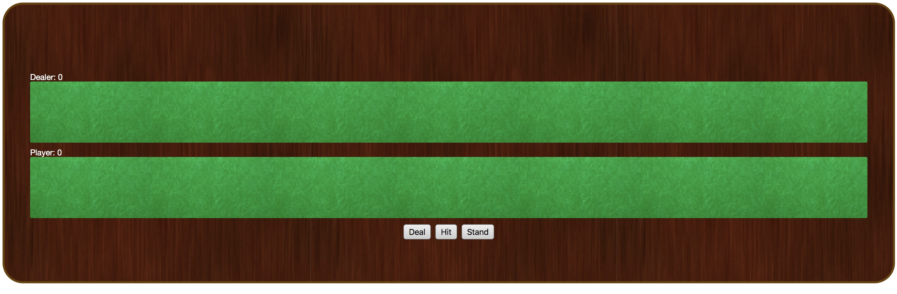
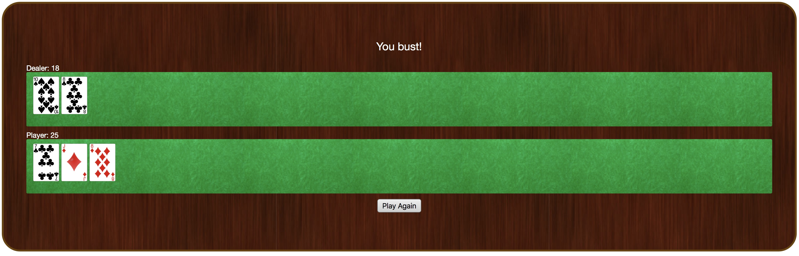
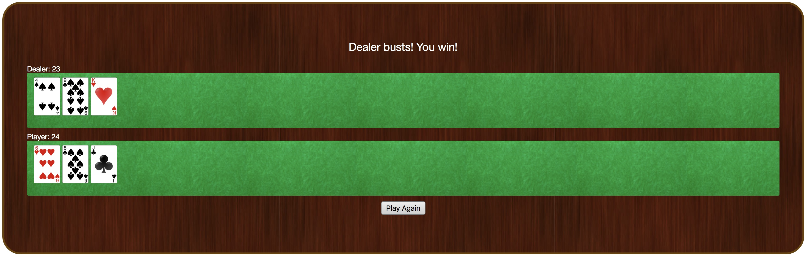

# Black Jack

This is a game of blackjack that can be played in the browser.

## Installing

You can play the game [here](http://justinuzoije.com/blackjack/index.html)


## Screenshots

Game Screen



Player Busts



Player Wins




## Code Examples

This creates all the cards that will be used in the game. It creates an empty array that will be used to represent all the cards in the game as they move from the player's hand, the dealer's hand, and to the table for the duration of the game. Each card object has a point property and a suit property.

The value of the point properties will be assigned from 1 to 13. It will add each card object to the cards array using the built-in push function. The first 1 through 13 cards will have the spades suit, and the next 13 cards will have the hearts suit, the clubs suit, then the diamond suit. This way there will always be 52 cards and each number and suit will be represented.

```

function newDeck() {  
  var cards = [];   
  for (var i = 1; i <= 13; i++) {  


    cards.push({ point: i, suit: 'spades' });
    cards.push({ point: i, suit: 'hearts' });
    cards.push({ point: i, suit: 'clubs' });
    cards.push({ point: i, suit: 'diamonds' });
  }
  return cards;
}

```

This function will display an image of the card. It will return an image based on the card's name and suit because the files
are named this way, such as "10 of spades". In the case that the card point has an 11, 12, or 13 the image file names are named after the face of the card instead, such as "king of spades".

```

function getCardImageUrl(card) {  //Pass in a card
  var cardName;   
  if (card.point === 1) {
    cardName = 'ace';
  } else if (card.point === 11) {
    cardName = 'jack';
  } else if (card.point === 12) {
    cardName = 'queen';
  } else if (card.point === 13) {
    cardName = 'king';
  } else {
    cardName = card.point;
  }
  return 'images/' + cardName + '_of_' + card.suit + '.png';
}

```

This function calculates the point value of a hand. It takes in an array of card objects and uses the built-in slice method to create a copy of the array. Putting in 0 means it will start at the 0th element and go on until the end.

The built-in sort method is used to put the array in order such as alphabetical order or increasing value. Passing in a function here means giving the sort method an alternative set of rules to follow. Putting in b - a is to create descending order.  Using card.point means the card object's point value is what will be used to determine it's size. So the cards will be all the 13 point cards, followed by the 12 point cards, all the way down to the 1 point cards last.

Reduce is a higher-order function that takes many elements and then combines them into one, such as getting the sum of multiple numbers. In this case the numbers are the point values of the card objects in the player or dealer's hand. If the card has a point value that's greater than 10, it's assigned to 10. This way all the face cards have the same point values, whether they are kings, queens, or jacks

The Ace card is special and can be valued at 1 or 11 depending on if it benefits the player. If the total so far doesn't cause the player to go over 21, then it's okay for the ace to be 11. If the player is already close to 21, the ace should only be counted as 1.

```

function calculatePoints(cards) {  
  cards = cards.slice(0);  
  cards.sort(function(a, b) {  
    return b.point - a.point;
  });
  return cards.reduce(function(sum, card) {  
    var point = card.point;  
    if (point > 10) {   
      point = 10;
    }
    if (point === 1 && sum < 11) {  
      point = 11;
    }
    return sum + point;
  }, 0);
}

```

This function is for the deal button on the screen and is activated by clicking on the button. It takes in an array, the player's hand, and an element selector, which is a way to precisely locate an element in the DOM using CSS selector rules.

Viewing the deck of playing cards as a stack of cards, it uses the JavaScript pop method to remove the last element of the array, which from our viewpoint is the top card of the deck. It then attaches this to the player's hand by using the push method to end of the hand array.

No matter what the card, we can get the picture of it by using the getCardImageUrl function and passing the card object itself in as the parameter.


```

  function dealACard(handArray, elementSelector) {
    card = deck.pop();
    handArray.push(card);
    cardUrl = getCardImageUrl(card);
    $(elementSelector).append(
      ''
    );
    updateScoreDisplay();
  }

```


## Author

* **Justin Uzoije**  - [GitHub Page](https://github.com/justinuzoije)

## License

This project is licensed under the MIT License - see the [LICENSE.md](LICENSE.md) file for details
